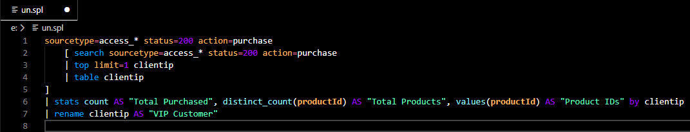
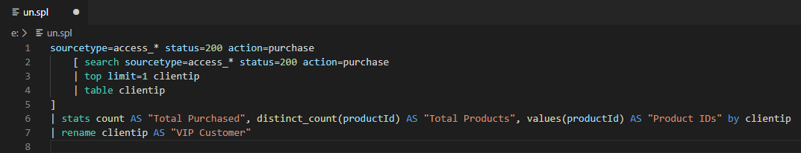
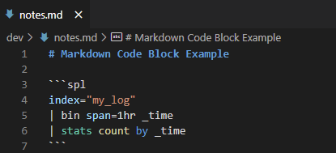

# Splunk Search Syntax Highlighter VSCode Extension README


Main repo for vscode splunk syntax highlighting

## Features

- Language auto-recognition and highlighting associated with `.spl` and `.splunk` files
- Markdown code block highlighting for `.md` files using ` ```spl` to open the code block 
- Highlights main search, stats, and eval functions, as well as escape keys
- Autocompletes macro ticks and brackets as well as quotes
- Highlights strings, parameters, arguments, macro names, and keywords








## How to install

### Install from Source

Install from source by downloading this repo and unzipping into your vscode extensions directory. The default directories are ususally, 

- Linux/macOS `~/.vscode/extensions`
- Windows `%USERPROFILE%\.vscode\extensions`

### Install in Visual Studio Code directly

Install directly in visual studio by going to the extensions tab and searching for `"splunk search"`. The quotes are imperative as the words are normally not treated as a phrase. Click the `Install` button on the  extension with the same name as this README and you're good to go.

## How to change splunk colors

You can try and use the following JSON blob:
```json
{
  "editor.tokenColorCustomizations": {
    "textMateRules": [
      {
        "scope": "constant.language.splunk_search",
        "settings":{
          "foreground": "#F58220"
        }
      },
      {
        "scope": "support.function.splunk_search",
        "settings":{
          "foreground": "#CF00CF"
        }
      },
      {
        "scope": "support.class.splunk_search",
        "settings":{
          "foreground": "#2662FD"
        }
      }
    ]
  }
}
```

## TODO

- [X] Highlight keywords (AND OR by as NOT true false)
- [X] Highlight macros
- [X] Highlight macro and eval command parameters/arguments
- [X] Highlight command options
  - For example, stats has the parameter `partitions=X`, `partitions` should be highlighted in this instance only after the `=` sign has been placed
- [X] Highlight variables after eval functions
- [X] DBConnect Command highlighting
- [ ] SQL Highlighting in `dbxquery` with `query=`
- [X] Publish to VSCE Marketplace
- [X] Change highlighting color to match Splunk search bar (manually)
  - Not sure if this is going to happen or not, as there is a need to stick to [Textmate Naming Conventions](https://macromates.com/manual/en/language_grammars#naming_conventions)
- [X] Allow params to be highlighted after nested eval functions
  - For example, in the command `| eval info=if(isnull(info),"N/A",info)`, currently the third `info` is not highlighted. This should be changed as the parameter is valid. The issue is that we need a recursive strategy for highlighting these params, but regular expressions don't have built-in recursive functionality. This may never happen
